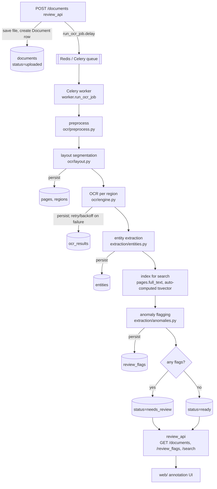

# Document Archive Pipeline

Ingests scanned images of handwritten and poorly-typed historical documents,
runs OCR, extracts structured entities, indexes the results in Postgres full-text
search, and surfaces low-confidence results for human review.

## Pipeline stages

1. **Upload** (`ingestion/`) — a scanned image is received via the API and
   written to the configured storage backend (local disk or S3); a `documents`
   row is created with status `uploaded`.
2. **Preprocess** (`ocr/preprocess.py`) — deskew, denoise, and binarize the
   raw scan so OCR gets a cleaner input, especially for faded/aged paper. Also
   computes a sharpness/contrast quality score to flag likely-poor-OCR scans
   early.
3. **OCR** (`ocr/engine.py`, `ocr/layout.py`) — before text extraction,
   `layout.py` segments the page into regions (paragraph, table, signature,
   margin annotation, stamp) via connected-component blobs + geometry
   heuristics, each with a bounding box and reading order. `engine.py` then
   routes each region to the matching OCR backend — Tesseract for typed
   text, a pluggable TrOCR/cloud backend for handwriting — falling back to
   the other backend if one fails or times out. Output is structured: full
   text, per-word bounding boxes, and document/line-level confidence.
4. **Extract** (`extraction/entities.py`) — a spaCy NER pipeline (base
   PERSON/GPE detection) plus two custom pipeline components layer
   rule-based parsing for historical dates ("the 3rd day of March, 1897",
   OCR-mangled digits like "l897") and currency (modern `$1,234.56` and
   pre-decimal `£3 12s 6d` ledger notation). Place names are disambiguated
   against a small historical-name gazetteer with rapidfuzz fuzzy matching,
   so a single OCR-misread character doesn't lose the match. Every entity
   carries a normalized value, raw text, a confidence blending the
   extraction method with OCR confidence, and an optional source region
   bbox.
5. **Index** (`storage/models.py`, `storage/queries.py`) — `documents` fans
   out to `pages` → `regions` → (`ocr_results`, `entities`), plus
   `review_flags`. `pages.full_text_search` is a stored generated tsvector
   column with a GIN index for full-text search (ranked via `ts_rank`,
   highlighted via `ts_headline`). `entities.date_value` uses a BRIN index
   instead of B-tree; `entities.raw_text`/`normalized_value` have pg_trgm
   GIN indexes for fuzzy "did you mean" search. `queries.py` has the
   example queries as parameterized functions, with a real EXPLAIN ANALYZE
   walkthrough (not a hypothetical one) of the BRIN/B-tree tradeoff in its
   module docstring.
6. **Review** (`extraction/anomalies.py`, `review_api/`, `web/`) — after OCR
   and extraction, `anomalies.py` flags content needing human review:
   `low_ocr_confidence` (a region or an individual word below threshold),
   `illegible` (near-zero confidence, or output that's mostly
   non-alphanumeric noise), `entity_conflict` (an implausible date/amount,
   or two person names within a document that are similar-but-not-identical
   — likely OCR variance on the same person), and `extraction_failure` (a
   table/signature region with no amount/person entity extracted from it).
   All thresholds are configurable (`config.py`), not hardcoded. Flags map
   onto `review_flags`, with a `status` (open/resolved/dismissed) for the
   review workflow.

The **review/search API** (`review_api/`) is what the annotation UI (`web/`)
consumes:

- `POST /documents` — upload a scan or batch; enqueues the async OCR job
  (a broker hiccup logs loudly but doesn't fail the upload — the row is
  the source of truth)
- `GET /documents` — paginated list; `GET /documents/{id}` — full detail:
  status, pages → regions → OCR text/entities, review flags
- `GET /documents/{id}/image` — serves the scan, optionally
  (`?annotate=true`) with region bounding boxes drawn on it, colored by
  region type
- `GET /search` — ranked full-text search with highlighted snippets,
  filterable by date range, entity type, location (fuzzy), and minimum OCR
  confidence
- `PATCH /entities/{id}` — records a human correction (`entity_corrections`
  keeps a full audit trail — original value, corrected value, reviewer,
  timestamp — `raw_text`, the original OCR output, is never touched)
- `GET /review_flags` — the review queue: open flags sorted by severity,
  each with enough document context to link straight to it;
  `PATCH /review_flags/{id}` — resolve or dismiss a flag
- `GET /stats` — dashboard summary: documents processed, pending review,
  average confidence, open flags by type

**Web annotation UI** (`web/`) — React + TypeScript + Mantine, consuming the
API above: a dashboard (stats, recent documents, upload), a split-pane
document view (pan/zoom image with clickable region overlays synced to an
entity panel with inline correction), a keyboard-navigable review queue,
and a search view with filters and highlighted snippets. See
[`web/README.md`](web/README.md) for the stack, structure, and how to run
it — including a note on which parts are a first-pass scaffold versus
tuned interaction design (per the project's own tool-choice notes, this
stage split component structure/API client/routing from interactive
polish).

This scaffold wires up stages 1-9 end-to-end: `POST /documents` saves the
scan, creates the `documents` row, and enqueues `worker.run_ocr_job`; the
Celery worker runs `pipeline.run.run_pipeline`, which drives every stage in
order — preprocess → layout segmentation → OCR → entity extraction →
anomaly flagging → index for search — and lands the document at a terminal
status (`ready` or `needs_review`). The full review/search API and
annotation UI read real, pipeline-populated data, not stubs.



Each stage checks persisted state before doing work (see `pipeline/run.py`'s
module docstring), so a retry after a mid-pipeline crash resumes rather than
redoing everything — the case this protects is OCR, the one genuinely
expensive per-region call. `python -m ingestion.batch <dir>` bulk-ingests a
folder of scans (optionally `--watch` to keep polling for new ones), for
archives that arrive as hundreds of files at once rather than one upload at
a time. `scripts/smoke_test.py` runs a handful of sample documents through
the real pipeline end-to-end and asserts they reach a terminal status with
entities/flags populated — see that file's docstring for how to run it.

### Trying the OCR engine

```bash
uv run python -m ocr.engine run path/to/scan.png
```

Prints structured JSON (text, per-word boxes/confidence, document/line
confidence). Requires the `tesseract-ocr` binary on PATH (installed
automatically in the Docker image) for the typed-text backend. The
handwriting backend (TrOCR) needs the optional `handwriting` extra:

```bash
uv sync --extra handwriting
```

### Trying entity extraction

```bash
uv run python -c "
from extraction.entities import extract_entities
for e in extract_entities('John Smith paid £3 12s 6d on the 3rd day of March, 1897 in Bombay.'):
    print(e)
"
```

Uses `en_core_web_sm` by default (installed automatically, no extra
download). For higher NER accuracy, install the transformer pipeline and
point `NER_MODEL` at it:

```bash
uv sync --extra ner-transformer
```
```
NER_MODEL=en_core_web_trf
```

### Trying the schema & example queries

```bash
docker compose up -d db
docker compose exec app uv run alembic upgrade head
docker compose exec -T db psql -U postgres -d document_archive -f - < scripts/seed_synthetic_data.sql
```

Seeds ~240k synthetic entities (in ~10s, via `generate_series` bulk SQL —
not an ORM loop) plus two hand-crafted documents with realistic
cross-referenced person/date/location/amount entities, for exercising
`storage/queries.py`'s example queries:

```bash
docker compose exec app uv run python -c "
from sqlalchemy import create_engine
from sqlalchemy.orm import sessionmaker
from storage import queries

engine = create_engine('postgresql+psycopg://postgres:postgres@db:5432/document_archive')
session = sessionmaker(bind=engine)()
for r in queries.full_text_search(session, 'John Smith Bombay'):
    print(r)
"
```

`tests/test_queries.py` runs against this seeded data when a live Postgres
is reachable (skipped otherwise, e.g. plain `uv run pytest` on the host —
the `db` service doesn't publish a host port, see Configuration below).

### Trying anomaly detection

```bash
uv run python -c "
from extraction.anomalies import detect_entity_conflicts
from extraction.entities import ExtractedEntity

entities = [
    ExtractedEntity('date', '2999-01-01', 'the 1st of January, 2999', 0.9, 0, 10),
    ExtractedEntity('person', 'John Smith', 'John Smith', 0.7, 0, 10),
    ExtractedEntity('person', 'John Smyth', 'John Smyth', 0.7, 20, 30),
]
for f in detect_entity_conflicts(entities):
    print(f)
"
```

Operates purely on the in-memory dataclasses from the OCR/extraction stages
(no DB needed) — `detect_all_anomalies` runs every check for one document's
regions/OCR results/entities at once.

### Trying the review API

```bash
docker compose up -d
docker compose exec app uv run alembic upgrade head
TOKEN=$(grep REVIEW_API_TOKEN .env | cut -d= -f2)

# upload
curl -H "Authorization: Bearer $TOKEN" -F "files=@scan.png" http://localhost:8000/documents

# full detail (status, pages/regions/entities, flags)
curl -H "Authorization: Bearer $TOKEN" http://localhost:8000/documents/<id>

# annotated image (region boxes drawn on it)
curl -H "Authorization: Bearer $TOKEN" "http://localhost:8000/documents/<id>/image?annotate=true" -o annotated.png

# search
curl -H "Authorization: Bearer $TOKEN" "http://localhost:8000/search?q=John+Smith&date_from=1890-01-01&date_to=1900-01-01"

# dashboard
curl -H "Authorization: Bearer $TOKEN" http://localhost:8000/stats
```

Interactive OpenAPI docs are at `http://localhost:8000/docs` once the stack
is up.

`tests/test_review_api.py` covers every endpoint: most run against an
in-memory SQLite schema (see `tests/conftest.py` — two Postgres-only column
types are swapped for plain equivalents there, since neither is exercised
by these tests), except `/search`, which needs real `tsvector`/`pg_trgm`
and is skipped gracefully without a live Postgres, same as
`tests/test_queries.py`.

### Trying the pipeline end-to-end

```bash
docker compose up -d --build
docker compose exec app uv run alembic upgrade head
TOKEN=$(grep REVIEW_API_TOKEN .env | cut -d= -f2)

curl -H "Authorization: Bearer $TOKEN" -F "files=@scan.png" http://localhost:8000/documents
# poll until status is `ready` or `needs_review`:
curl -H "Authorization: Bearer $TOKEN" http://localhost:8000/documents/<id>
```

For a folder of many scans at once:

```bash
docker compose exec app uv run python -m ingestion.batch /data/documents/incoming --concurrency 8
```

Or run the smoke test (a handful of generated sample scans through the real
pipeline, asserting each reaches a terminal status with entities/flags
populated):

```bash
docker compose run --rm app python scripts/smoke_test.py
```

`tests/test_pipeline.py` covers the pipeline's stage logic and resumability
against the shared SQLite fixture (Tesseract mocked, same convention as
`tests/test_ocr_engine.py`); `scripts/smoke_test.py` is the one place a real
`tesseract` binary and real Postgres actually run together.

### Evaluating OCR/extraction quality

```bash
docker compose run --rm app python -m eval.report
```

Runs OCR + entity extraction (no DB/Celery — see `eval/README.md`) against
a small checked-in ground-truth set (`eval/fixtures/`) and reports
character/word error rate plus per-entity-type precision/recall/F1, with
the worst-scoring examples shown for inspection. Use it to judge a pipeline
change (a new OCR backend, a regex tweak, a threshold change) objectively
instead of by eye — see `eval/README.md` for the ground-truth format and
how to add new examples.

## Project layout

```
ingestion/     upload handling (upload.py) + batch/folder-watch CLI (batch.py)
ocr/           OCR engine abstraction (multi-backend)
extraction/    entity extraction (entities.py) + review-flagging (anomalies.py)
pipeline/      orchestrates the above into one pipeline (run.py) -- see worker.py
storage/       SQLAlchemy models, DB session, full-text/BRIN/trigram search queries
review_api/    FastAPI app: health, documents, search, entities, review_flags, stats
web/           annotation UI — React/TypeScript, standalone Vite app (see web/README.md)
tests/         pytest suite (backend)
alembic/       DB migrations
scripts/       synthetic data seeding (scale) + pipeline smoke test (correctness)
eval/          OCR/extraction quality evaluation harness (see eval/README.md)
config.py      pydantic-settings config, read from .env
worker.py      Celery app + task definitions for async pipeline jobs
```

## Requirements

- Python 3.11+
- [uv](https://docs.astral.sh/uv/) for dependency management
- Node.js 20+ and npm, if working on `web/` (the annotation UI)
- Docker + Docker Compose for running the full stack

## Local development

```bash
cp .env.example .env
uv sync
uv run alembic upgrade head
uv run uvicorn review_api.main:app --reload
```

Run tests:

```bash
uv run pytest
```

## Running the full stack (Docker Compose)

```bash
cp .env.example .env
docker compose up --build
```

This starts Postgres, Redis, the FastAPI app (`app`), and a Celery worker
(`worker`) for async OCR jobs. Once the `db` service is healthy, run
migrations against it:

```bash
docker compose exec app uv run alembic upgrade head
```

Health check (open, no auth needed):

```bash
curl http://localhost:8000/health
```

`/documents*` requires a bearer token (see Configuration below):

```bash
curl -H "Authorization: Bearer $REVIEW_API_TOKEN" http://localhost:8000/documents
```

The `db` service no longer publishes its port to the host — `app`/`worker`
reach it over the internal compose network. For a local `psql` shell:

```bash
docker compose exec db psql -U postgres -d document_archive
```

## Configuration

All configuration is via environment variables (see `.env.example`). Two
have no default and the app fails fast at startup if they're unset:

- `DATABASE_URL` — Postgres connection string. The default in
  `.env.example` (`postgres`/`postgres`) is for local dev only — **rotate
  these credentials before any real deployment.**
- `REVIEW_API_TOKEN` — bearer token required on all `/documents*` routes
  (`/health` stays open for container healthchecks). Generate one with
  `python -c "import secrets; print(secrets.token_urlsafe(32))"`.

Everything else has a sane default:

- `DB_POOL_SIZE` / `DB_MAX_OVERFLOW` / `DB_POOL_RECYCLE_SECONDS` — SQLAlchemy
  connection pool tuning
- `OCR_ENGINE` — `tesseract` | `trocr` | `textract`
- `STORAGE_BACKEND` — `local` | `s3`, plus `STORAGE_LOCAL_PATH` /
  `STORAGE_S3_BUCKET` / `STORAGE_S3_REGION`
- `MAX_UPLOAD_SIZE_BYTES` — upload size cap enforced by `ingestion.upload`
- `CELERY_BROKER_URL` / `CELERY_RESULT_BACKEND` — Redis URLs for the async
  job queue
- `CORS_ALLOWED_ORIGINS` — browser origins allowed to call the API (JSON
  array; defaults to `["http://localhost:5173"]`, the `web/` dev server).
  CORS only gates which origins a *browser* will let through — the bearer
  token still authorizes every request beyond `/health`.

`GET /documents` is paginated (`limit`, default 50, max 500; `offset`) —
it does not return the whole table in one response.

## Known limitations / accepted follow-up work

- `ocr/layout.py`'s region classification thresholds are tuned against
  synthetic test fixtures, not validated against real scans — expect
  misclassification on real documents until calibrated (planned for the
  stage 6 review-flagging work).
- `OCRRouter`'s per-backend timeout can't forcibly kill a hung thread
  (a Python limitation) — on timeout it stops waiting and falls back
  immediately, but the original call keeps running in the background until
  it finishes on its own. A true kill needs a process-based executor.
- `extraction/entities.py`'s location detection depends on spaCy's base NER
  first finding *some* entity span — `en_core_web_sm` was trained mostly on
  modern text, so it sometimes mislabels historical/colonial place names
  (e.g. "Calcutta" as PRODUCT) or misses them entirely. Two bounded
  fallbacks recover common cases (checking ORG/PRODUCT-labeled spans and
  untagged proper nouns against the gazetteer), but only ever on an exact or
  fuzzy gazetteer hit — a place with no gazetteer entry that the base model
  also fails to tag will be missed. `en_core_web_trf` (the `ner-transformer`
  extra) would improve base coverage.
- `web/`'s pan/zoom (drag-to-pan, scroll-to-zoom), confidence color
  thresholds, and keyboard-shortcut feel are a first pass, not tuned —
  deliberately so: the project's own stage 8 notes split this scaffold
  (component structure, typed API client, routing) from the interactive
  "look at it, nudge it" polish pass, which needs a human watching in real
  time rather than an autonomous agent. Everything is functionally wired
  and tested end-to-end against a live backend; the remaining work is feel,
  not plumbing.
- `pipeline/run.py` works one page per document (`page_number=1`) —
  nothing upstream splits a multi-page source (e.g. a multi-page TIFF/PDF)
  into separate pages yet; each upload is treated as a single-page scan.
- A region's OCR result reloaded from a prior pipeline run (i.e. the
  pipeline resumed after a crash) has no persisted per-word confidences —
  the schema only stores the aggregate — so `detect_low_ocr_confidence`'s
  word-level variant only applies to a region OCR'd in the *current* run,
  not a resumed one. The region-level checks (which only need the
  aggregate) are unaffected.
- `ingestion/batch.py --watch` polls the directory rather than using an
  OS-level filesystem-event watcher (inotify/watchdog) — one less
  dependency, and archive drop-offs aren't latency-sensitive; swap in an
  event-based watcher if sub-second pickup ever matters.
- Anomaly flags map back to a persisted `region_id`/`entity_id` on a
  best-effort basis (matching the transient bbox/raw-text a flag carries
  against what was just persisted) — correct for the common case, but two
  entities in the same region with byte-identical raw text could have a
  flag attributed to the wrong one of the pair.
